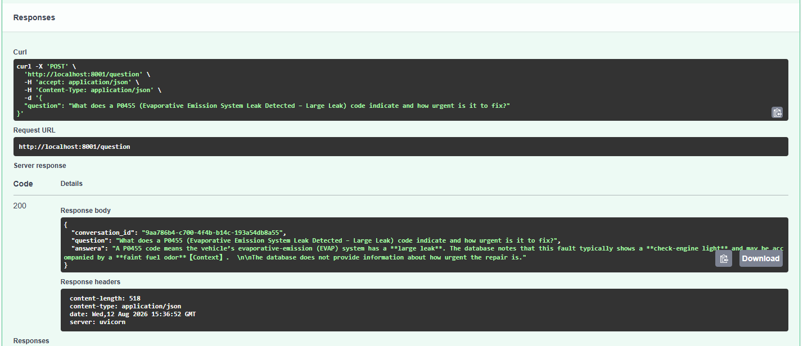
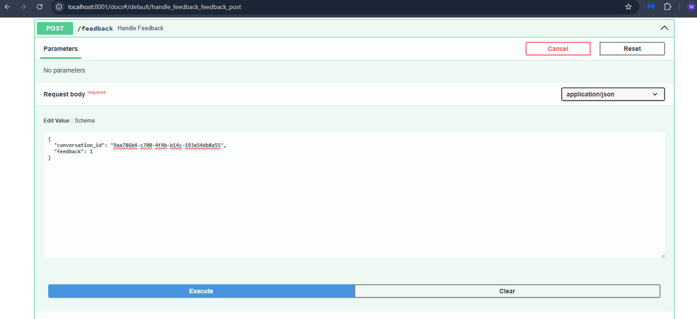
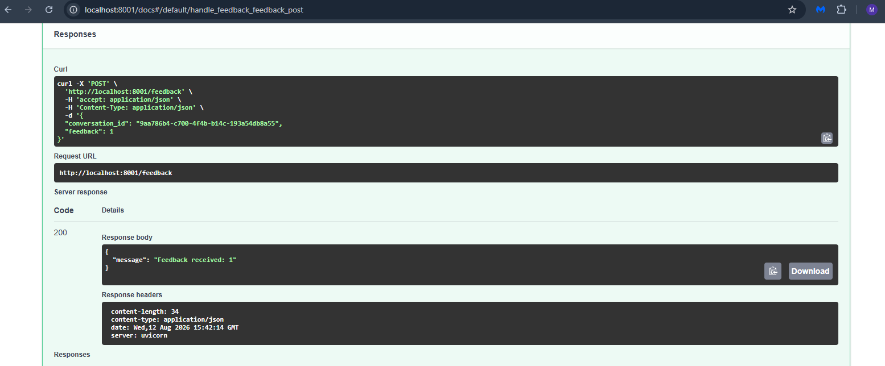
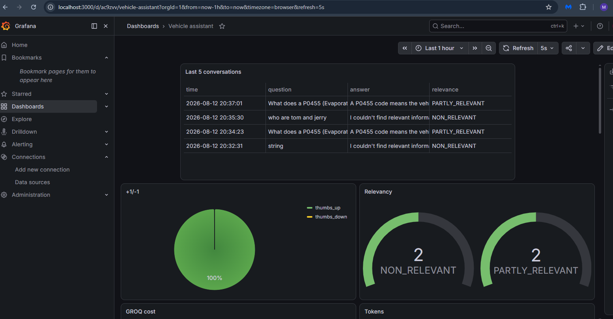
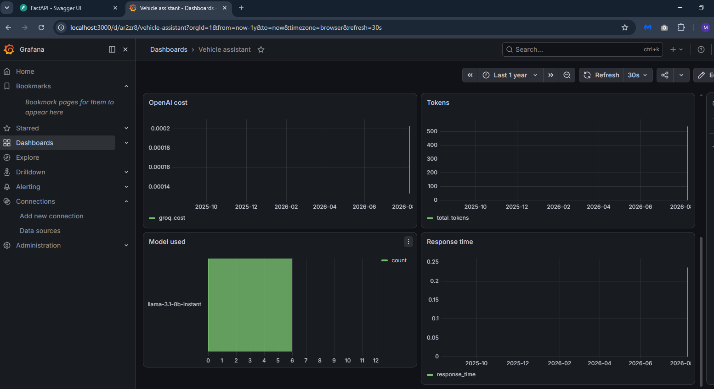

# 🚗 Vehicle Diagnostic Assistant (Agentic RAG)

An enterprise-grade, fully observable **Agentic Retrieval-Augmented Generation (RAG)** platform designed for automotive diagnostics, OBD-II trouble code analysis, vehicle symptoms troubleshooting, and repair recommendations.

The system is powered by **LangGraph** for cyclic multi-step state orchestration, **ChromaDB** for local dense semantic search, **SQLite BM25 (`sqlitesearch`)** for sparse full-text keyword retrieval, **Reciprocal Rank Fusion (RRF)** for hybrid search blending, **LLM Reranking**, **Document Relevance Grading**, **Adaptive Query Rewriting**, **Automated LLM-as-a-Judge Evaluation**, **OpenTelemetry** for distributed operational tracing, **PostgreSQL** for relational persistence, and **Grafana** for real-time analytics and monitoring.

---

## 📑 Table of Contents

- [🛠️ Technology Stack & Component Breakdown](#️-technology-stack--component-breakdown)
- [📁 Repository & Directory Architecture](#-repository--directory-architecture)
- [🏗️ System Architecture & LangGraph Workflow](#️-system-architecture--langgraph-workflow)
- [🔍 Ingestion & Hybrid Search Pipeline](#-ingestion--hybrid-search-pipeline)
- [📊 Evaluation & Benchmark Framework](#-evaluation--benchmark-framework)
- [🧪 Synthetic Data Generation & Offline Benchmarking](#-synthetic-data-generation--offline-benchmarking)
- [🗄️ Database Architecture & OpenTelemetry Tracing](#️-database-architecture--opentelemetry-tracing)
- [📈 Grafana Monitoring & Observability](#-grafana-monitoring--observability)
- [⚙️ Environment Variables Configuration](#️-environment-variables-configuration)
- [🚀 Quickstart & Deployment Guide](#-quickstart--deployment-guide)
  - [Method 1: Docker Compose Deployment (Recommended)](#method-1-docker-compose-deployment-recommended)
  - [Method 2: Local Development Setup](#method-2-local-development-setup)
- [📖 API Reference & Examples](#-api-reference--examples)
- [💻 Comprehensive Command Reference](#-comprehensive-command-reference)

---

## 🛠️ Technology Stack & Component Breakdown

Every library and tool in this project fulfills a dedicated role in the pipeline:

| Category | Technology / Library | Role & Implementation Details |
| :--- | :--- | :--- |
| **Agentic Workflow** | **LangGraph (`StateGraph`)** | Orchestrates cyclic state machine (`project/versions/v2/rag.py`) managing Query Expansion ➔ Hybrid Search ➔ LLM Reranker ➔ Document Grading ➔ Conditional Routing ➔ Query Rewriting ➔ Answer Generation / Fallback. |
| **LLM Orchestration** | **LangChain & ChatOpenAI** | Interfaces with Groq Cloud LLM API (`openai/gpt-oss-120b`) via OpenAI-compatible endpoint with temperature=0 and JSON structured output parsing (`with_structured_output`). |
| **Local Dense Embeddings** | **ONNX Runtime & Tokenizers** | Custom CPU-based embedder (`embedder.py`) executing quantized `Xenova/all-MiniLM-L6-v2` ONNX model (384 dimensions) with L2 normalization; zero API embedding cost or latency. |
| **Model Asset Management** | **Hugging Face Hub** | Automated model downloader (`download.py`) fetching ONNX weights and tokenizer configuration into `models/Xenova/all-MiniLM-L6-v2/`. |
| **Vector Database** | **ChromaDB & `langchain-chroma`** | Persistent vector databases (`project/dbs/chroma_db` and `project/dbs/chroma_test_db`) storing issue chunk embeddings (`RecursiveCharacterTextSplitter`, chunk size 500, overlap 200). |
| **Sparse Keyword Search** | **`sqlitesearch` (BM25 SQLite)** | SQLite-backed full-text inverted index (`project/dbs/issues.db`) with optimized multi-field boosting (`obd_code`, `likely_causes`, `component`, `system`, `severity`, etc.). |
| **Hybrid Rank Fusion** | **Reciprocal Rank Fusion (RRF)** | Merges dense vector similarity rankings and sparse BM25 rankings across original and expanded queries ($k=1$). |
| **Reranking & Expansion** | **Pydantic Structured Outputs** | Type-safe JSON schemas (`QueryExpansions`, `RankOrder`, `VehicleIssue`, `GroundTruthRetrival`) enforcing structured LLM outputs for query expansion and reranking. |
| **REST API Server** | **FastAPI & Uvicorn** | High-performance asynchronous API server (`project/app.py`) providing `/question` and `/feedback` endpoints with UUID conversation tracking. |
| **Relational Database** | **PostgreSQL 16 & `psycopg2-binary`** | Persists conversation logs, response latency, token consumption, Groq API cost, LLM-as-a-Judge relevance scores, and user feedback (+1 / -1). |
| **Distributed Tracing** | **OpenTelemetry SDK** | Custom `PostgresSpanExporter` (`project/db_setup/tracerdb.py`) intercepting spans (`search`, `rewrite`, `llm`, `rag`) and recording token attributes, duration, and cost into the `spans` table. |
| **Dashboard & Monitoring** | **Grafana** | 15-panel real-time operational dashboard (`project/grafana/dashboard.json`) provisioned programmatically via `project/grafana/init.py` with custom Service Account and datasource UID. |
| **Package Manager** | **Astral `uv`** | Ultra-fast Python dependency resolver and installer (`pyproject.toml`, `uv.lock`) used across local and containerized Docker environments. |
| **Data Processing** | **Pandas, NumPy, scikit-learn, tqdm** | Data wrangling, Hit Rate & MRR retrieval metrics calculation, Monte Carlo boosting weight optimization, and ground-truth dataset generation. |
| **Containerization** | **Docker & Docker Compose** | Multi-container orchestration managing `app` (FastAPI), `postgres` (PostgreSQL 16), and `grafana` (Grafana Latest). |

---

## 📁 Repository & Directory Architecture

```
vehicle_assistant_v2/
│
├── Dockerfile                                 # Multi-stage Docker build with uv & ONNX model download
├── docker-compose.yaml                        # Multi-service orchestration (app, postgres, grafana)
├── pyproject.toml                             # Project dependencies and packaging metadata
├── uv.lock                                    # Locked dependency graph
├── .python-version                            # Python version definition (3.12)
├── .env.example                               # Environment variable blueprint
├── .env                                       # Active local environment variables
├── download.py                                # Script downloading ONNX weights and tokenizer from Hugging Face
├── embedder.py                                # Custom ONNX Runtime + Tokenizers CPU embedding engine
│
├── models/                                    # Local ONNX model storage
│   └── Xenova/
│       └── all-MiniLM-L6-v2/
│           ├── model.onnx                     # Quantized ONNX model graph
│           └── tokenizer.json                 # Hugging Face fast tokenizer definition
│
├── images/                                    # Documentation screenshots & architecture diagrams
│   ├── i1.png - i6.png                        # API tests, Grafana dashboards, and evaluation runs
│
└── project/                                   # Application source code
    ├── app.py                                 # FastAPI REST server (/question, /feedback)
    ├── data-creation-and-answer-evaluation.ipynb # Synthetic data generation & RAG evaluation notebook
    │
    ├── data/                                  # Dataset repository
    │   ├── data.csv                           # Synthetic dataset of 50 diagnostic issues with OBD-II codes
    │   ├── ground-truth-retrieval.jsonl       # 100 benchmark QA pairs with target keywords & reference answers
    │   ├── rag-eval-groq/                     # Model evaluation answer dumps
    │   │   └── openai/
    │   │       └── gpt-oss-120b.csv           # Evaluation outputs and relevance judgements
    │   └── vehicles/issues/                   # Vehicle issues raw data directory
    │
    ├── dbs/                                   # Persistent storage databases
    │   ├── issues.db                          # SQLite database for BM25 text search (sqlitesearch)
    │   ├── chroma_db/                         # Production ChromaDB vector store
    │   └── chroma_test_db/                    # Evaluation & test ChromaDB vector store
    │
    ├── db_setup/                              # Database initialization & tracing exporters
    │   ├── db.py                              # PostgreSQL connector, schema creation, conversation & feedback persistence
    │   └── tracerdb.py                        # OpenTelemetry custom PostgresSpanExporter for span collection
    │
    ├── ingests/                               # Data loading & indexing pipelines
    │   ├── ingest_fresh_or_load_text_search_data.py   # SQLite BM25 index builder / loader
    │   └── ingest_fresh_or_load_vector_search_data.py # ChromaDB vector store builder / chunk loader
    │
    ├── evaluations/                           # Retrieval evaluation & parameter optimization
    │   ├── evaluate_text_retrival.py          # BM25 retrieval evaluation + Monte Carlo boost optimization
    │   ├── evaluate_vector_retrival.py        # ChromaDB dense vector retrieval evaluation
    │   └── evaluate_hybrid_retrival.py        # Hybrid RRF (BM25 + Vector) retrieval evaluation
    │
    ├── grafana/                               # Observability provisioning
    │   ├── dashboard.json                     # 15-panel pre-configured Grafana monitoring dashboard
    │   └── init.py                            # Automated Service Account, Datasource, and Dashboard provisioning
    │
    └── versions/                              # RAG pipeline implementations
        └── v2/
            └── rag.py                         # Production LangGraph Agentic RAG implementation
```

---

## 🏗️ System Architecture & LangGraph Workflow

```
                                  [ User Request / Client ]
                                             │
                                             ▼
                                 [ FastAPI: POST /question ]
                                             │
                                             ▼
                     ┌───────────────────────────────────────────────┐
                     │         LangGraph Agentic Pipeline            │
                     │          (project/versions/v2/rag.py)         │
                     └───────────────────────┬───────────────────────┘
                                             │
                                             ▼
                                  [ Node: expand_query ]
                         (Generates 1 domain-specific variation)
                                             │
                                             ▼
                                  [ Node: hybrid_search ]
                     ┌───────────────────────┴───────────────────────┐
                     │                                               │
                     ▼                                               ▼
         [ Sparse Search: BM25 ]                         [ Dense Search: ChromaDB ]
        (SQLite with field boosting)                   (ONNX MiniLM-L6-v2 Embeddings)
                     │                                               │
                     └───────────────────────┬───────────────────────┘
                                             ▼
                                   [ RRF Fusion (k=1) ]
                                             │
                                             ▼
                                     [ Node: rerank ]
                         (LLM-based structured reranker: RankOrder)
                                             │
                                             ▼
                                     [ Node: grade ]
                        (Scores 0.0 - 1.0; filters docs with score >= 0.5)
                                             │
                                             ▼
                            [ Decision: should_retry_or_generate ]
                                ├── Any relevant docs? ──────► [ Node: generate ]
                                │                                    │
                                ├── No relevant docs & retries < 2?   │
                                │         │                          │
                                │         ▼                          │
                                │   [ Node: rewrite ]                │
                                │   (Rewrites query & loops back     │
                                │    to hybrid_search)               │
                                │                                    │
                                └── No relevant docs & retries >= 2? │
                                          │                          │
                                          ▼                          │
                                  [ Node: fallback ]                 │
                                          │                          │
                                          └──────────┬───────────────┘
                                                     ▼
                                      [ Auto-Evaluate Relevance ]
                                      (LLM-as-a-Judge: RELEVANT /
                                       PARTLY_RELEVANT / NON_RELEVANT)
                                                     │
                                                     ▼
                                      [ OpenTelemetry Tracing ]
                                      (Spans: search, rewrite, llm, rag)
                                                     │
                         ┌───────────────────────────┴───────────────────────────┐
                         ▼                                                       ▼
            [ PostgreSQL Database ]                                     [ API JSON Response ]
       - conversations (tokens, cost, eval)                       - conversation_id
       - spans (traces, duration, tokens)                         - question
       - feedback (+1 / -1)                                       - answera
                         │                                                       │
                         ▼                                                       ▼
               [ Grafana Dashboard ]                                     [ Client Feedback ]
             (15 real-time live panels)                                   (POST /feedback)
```

### Detailed LangGraph Node Execution Lifecycle

1. **`expand_query`**: Entry point node. Uses structured LLM generation (`QueryExpansions`) to create a domain-focused technical query variation with OBD-II terminology and component synonyms.
2. **`hybrid_search`**: Executes multi-query search across both sparse BM25 text index (`sqlitesearch`) and dense vector store (`ChromaDB`). Fuses candidate lists using Reciprocal Rank Fusion (`rrf`, $k=1$) up to `num_results` (top 10).
3. **`rerank`**: Takes fused context chunks and submits them to the LLM with a strict JSON structured output schema (`RankOrder`). Re-orders chunks from most to least relevant, deduplicates IDs, and preserves missing chunks safely.
4. **`grade`**: Evaluates each retrieved document chunk against the query on a continuous relevance scale (0.0 to 1.0). Filters out chunks scoring below `0.5` and computes the average retrieval confidence.
5. **`should_retry_or_generate` (Conditional Router)**:
   - **`generate`**: If at least 1 document passed grading ($\ge 0.5$), proceed to generation.
   - **`rewrite`**: If 0 documents passed grading and `retry_count < max_retries` (default 2), trigger query rewriting.
   - **`fallback`**: If 0 documents passed grading and retries exhausted, return a graceful fallback response.
6. **`rewrite`**: Uses the LLM to rephrase the question to better match automotive service manuals and diagnostic trees, increments `retry_count`, and routes back to `hybrid_search`.
7. **`generate`**: Generates a strict, hallucination-free response grounded **ONLY** in retrieved context. Calculates token usage, computes estimated Groq API costs, invokes `evaluate_relevance` (LLM-as-a-judge), and writes execution spans via OpenTelemetry.
8. **`fallback`**: Returns a helpful error explanation indicating lack of diagnostic coverage with 0 token/cost overhead.

---

## 🔍 Ingestion & Hybrid Search Pipeline

### 1. Local ONNX Dense Embeddings (`embedder.py` & `download.py`)
- Downloads the ONNX quantized `Xenova/all-MiniLM-L6-v2` model directly from Hugging Face Hub (`download.py`).
- Executes tokenization and ONNX inference on local CPU (`CPUExecutionProvider`) via `Embedder`.
- Produces normalized 384-dimensional embeddings for documents and queries without network calls.

### 2. Dense Vector Store Ingestion (`project/ingests/ingest_fresh_or_load_vector_search_data.py`)
- Reads `project/data/data.csv` (50 vehicle issues).
- Converts each issue row into structured text with metadata (`issue_id`, `source`).
- Splits documents into chunks using `RecursiveCharacterTextSplitter(chunk_size=500, chunk_overlap=200)`.
- Builds or loads persistent Chroma collections at `project/dbs/chroma_db` (or `chroma_test_db`).

### 3. Sparse SQLite BM25 Ingestion (`project/ingests/ingest_fresh_or_load_text_search_data.py`)
- Uses `sqlitesearch` (`TextSearchIndex`) to index vehicle diagnostic records in `project/dbs/issues.db`.
- Indexes text fields: `issue_name`, `obd_code`, `system`, `component`, `severity`, `symptoms`, `likely_causes`, `diagnostic_steps`, `diy_or_mechanic`.
- Indexes keyword field: `issue_id`.

### 4. Reciprocal Rank Fusion (RRF) & Field Boosting
- Fuses rankings with $RRF(d) = \sum_{m \in M} \frac{1}{k + rank_m(d)}$ where $k=1$.
- Applies optimal field boosting weights discovered through retrieval optimization:
  - `likely_causes`: **2.55**
  - `component`: **2.32**
  - `system`: **2.14**
  - `obd_code`: **2.10**
  - `severity`: **1.78**
  - `issue_name`: **1.20**
  - `symptoms`: **0.97**
  - `diagnostic_steps`: **0.32**
  - `diy_or_mechanic`: **0.12**

---

## 📊 Evaluation & Benchmark Framework

The project includes an automated evaluation suite (`project/evaluations/`) that benchmarks retrieval quality across 100 ground-truth questions (`project/data/ground-truth-retrieval.jsonl`) using two primary information retrieval metrics:

$$\text{Hit Rate} = \frac{\text{Queries with } \ge 1 \text{ relevant doc in top-K}}{\text{Total Queries}}$$

$$\text{MRR (Mean Reciprocal Rank)} = \frac{1}{|Q|} \sum_{i=1}^{|Q|} \frac{1}{\text{rank}_i}$$

### Evaluation Scripts

1. **`evaluate_text_retrival.py`**:
   - Splits ground truth into validation (first 50) and test (remaining 50) sets.
   - Runs Monte Carlo search optimization (`simple_optimize`) across parameter ranges `(0.0, 3.0)` to maximize `Hit Rate + MRR`.
   - Evaluates baseline vs. boosted BM25 performance.

2. **`evaluate_vector_retrival.py`**:
   - Loads test collection in `project/dbs/chroma_test_db`.
   - Evaluates dense ONNX semantic search across all 100 ground truth queries for top-K results.

3. **`evaluate_hybrid_retrival.py`**:
   - Runs the combined BM25 + ChromaDB pipeline with RRF fusion and field boosting against the ground-truth benchmark.

---

## 🧪 Synthetic Data Generation & Offline Benchmarking

The notebook `project/data-creation-and-answer-evaluation.ipynb` implements the complete offline data generation and evaluation lifecycle:

1. **Synthetic Diagnostic Issues Generation**:
   - Uses Groq API (`openai/gpt-oss-120b`) with Pydantic structured output (`VehicleIssueDataset`, `VehicleIssue`).
   - Generates 50 unique, non-duplicate automotive problems spanning Engine, Transmission, Brakes, Electrical, Suspension, and Cooling systems with real OBD-II codes.
   - Saves structured dataset to `project/data/data.csv`.

2. **Ground Truth Question Generation**:
   - Generates 2 realistic user questions per issue (100 total QA pairs).
   - Generates 3–6 critical keywords required in the context, a reference answer, and category classifications (`direct_fact`, `causal`, `diagnostic`, `spanning`, `temporal`).
   - Saves records in JSON Lines format to `project/data/ground-truth-retrieval.jsonl`.

3. **Offline RAG Quality Evaluation**:
   - Samples ground truth questions, runs end-to-end `rag.query()`, extracts answer, relevance classification (`RELEVANT`, `PARTLY_RELEVANT`, `NON_RELEVANT`), and explanation.
   - Exports results to `project/data/rag-eval-groq/openai/gpt-oss-120b.csv`.

---

## 🗄️ Database Architecture & OpenTelemetry Tracing

### PostgreSQL Tables Schema (`project/db_setup/db.py`)

#### 1. `conversations` Table
| Column | Type | Description |
| :--- | :--- | :--- |
| `id` | `TEXT PRIMARY KEY` | UUID uniquely identifying the conversation. |
| `question` | `TEXT NOT NULL` | Raw user question submitted to the assistant. |
| `answer` | `TEXT NOT NULL` | Synthesized answer generated from retrieved context. |
| `model_used` | `TEXT NOT NULL` | LLM model identifier (e.g. `openai/gpt-oss-120b`). |
| `response_time` | `FLOAT NOT NULL` | Total generation latency in seconds. |
| `relevance` | `TEXT NOT NULL` | LLM-as-a-judge rating (`RELEVANT`, `PARTLY_RELEVANT`, `NON_RELEVANT`). |
| `relevance_explanation`| `TEXT NOT NULL` | Justification provided by LLM-as-a-judge evaluator. |
| `prompt_tokens` | `INTEGER NOT NULL` | Number of prompt tokens used during generation. |
| `completion_tokens` | `INTEGER NOT NULL` | Number of completion tokens generated. |
| `total_tokens` | `INTEGER NOT NULL` | Total generation tokens. |
| `eval_prompt_tokens` | `INTEGER NOT NULL` | Prompt tokens used by the evaluation judge. |
| `eval_completion_tokens`| `INTEGER NOT NULL`| Completion tokens used by the evaluation judge. |
| `eval_total_tokens` | `INTEGER NOT NULL` | Total tokens consumed by the evaluation judge. |
| `groq_cost` | `FLOAT NOT NULL` | Estimated API cost ($0.15/1M input, $0.60/1M output). |
| `timestamp` | `TIMESTAMPTZ NOT NULL`| Timezone-aware timestamp (`ZoneInfo`). |

#### 2. `feedback` Table
| Column | Type | Description |
| :--- | :--- | :--- |
| `id` | `SERIAL PRIMARY KEY` | Auto-incrementing feedback entry ID. |
| `conversation_id` | `TEXT REFERENCES conversations(id)` | Foreign key linking feedback to a conversation. |
| `feedback` | `INTEGER NOT NULL` | `+1` (thumbs up / positive) or `-1` (thumbs down / negative). |
| `timestamp` | `TIMESTAMPTZ NOT NULL`| Timestamp when feedback was submitted. |

#### 3. `spans` Table (OpenTelemetry Tracing) (`project/db_setup/tracerdb.py`)
| Column | Type | Description |
| :--- | :--- | :--- |
| `id` | `SERIAL PRIMARY KEY` | Auto-incrementing span record ID. |
| `name` | `TEXT` | Span operation name (`rag`, `search`, `rewrite`, `llm`). |
| `start_time` | `BIGINT` | Nanosecond epoch start timestamp. |
| `end_time` | `BIGINT` | Nanosecond epoch end timestamp. |
| `input_tokens` | `INTEGER` | Span input token count attribute. |
| `output_tokens`| `INTEGER` | Span output token count attribute. |
| `cost` | `REAL` | Calculated operation cost attribute. |

---

## 📈 Grafana Monitoring & Observability

Grafana runs on port `3000` (`http://localhost:3000`). The datasource and dashboard are provisioned automatically using `project/grafana/init.py` via Grafana's Service Account API.

### Automated Provisioning Features (`project/grafana/init.py`)
- Creates admin Service Account `ProgrammaticSA` and generates `ProgrammaticToken`.
- Configures PostgreSQL datasource with a consistent UID (`vehicle-assistant-postgres`).
- Injects datasource UID into `project/grafana/dashboard.json` across all panel and target definitions.
- Imports the dashboard titled **"Vehicle assistant"**.

### Dashboard Panels Overview (15 Panels)

```
┌─────────────────────────────────────────┬─────────────────────────────────────────┐
│           Last 5 conversations          │                 +1 / -1                 │
│              (Table Panel)              │               (Pie Chart)               │
├─────────────────────────────────────────┼─────────────────────────────────────────┤
│                Relevancy                │                GROQ Cost                │
│              (Gauge Panel)              │              (Time Series)              │
├─────────────────────────────────────────┼─────────────────────────────────────────┤
│                 Tokens                  │               Model Used                │
│              (Time Series)              │              (Bar Chart)                │
├─────────────────────────────────────────┼─────────────────────────────────────────┤
│              Response Time              │         Recent Span Operations          │
│              (Time Series)              │              (Table Panel)              │
├─────────────────────────────────────────┼─────────────────────────────────────────┤
│         Input Tokens Over Time          │         Output Tokens Over Time         │
│              (Time Series)              │              (Time Series)              │
├─────────────────────────────────────────┼─────────────────────────────────────────┤
│             Cost Over Time              │           Operation Duration            │
│              (Time Series)              │              (Time Series)              │
├─────────────────────────────────────────┼─────────────────────────────────────────┤
│             Operation Types             │          Operation Statistics           │
│               (Pie Chart)               │              (Table Panel)              │
└─────────────────────────────────────────┴─────────────────────────────────────────┘
```

---

## ⚙️ Environment Variables Configuration

Create a `.env` file in the project root:

```ini
# ============================================================
# LLM Configuration (Groq Cloud API)
# ============================================================
GROQ_API_KEY=gsk_your_groq_api_key_here
AI_MODEL=openai/gpt-oss-120b
MODEL_BASE_URL=https://api.groq.com/openai/v1

# ============================================================
# PostgreSQL Database Configuration
# ============================================================
POSTGRES_HOST=postgres
POSTGRES_PORT=5432
POSTGRES_DB=vehicle_assistant
POSTGRES_USER=user
POSTGRES_PASSWORD=password
TZ=Asia/Karachi

# ============================================================
# SQLite & ChromaDB Vector Store Paths
# ============================================================
SQLITESEARCHDB=dbs/issues.db
CHROMA_COLLECTION=obd_diagnostics
CHROMA_TEST_COLLECTION=obd_diagnostics_test
CHROMA_DB_DIR=dbs/chroma_db
CHROMA_DB_TEST_DIR=dbs/chroma_test_db
SQLITE_TRACES_DB=/app/traces/traces.db

# ============================================================
# Data Paths
# ============================================================
DATA_FILE_PATH=data/data.csv
DATA_TEST_FILE_PATH=data/ground-truth-retrieval.jsonl
DATA_EVAL_ANSWER_FILE_PATH=data/rag-eval-groq
DATA_PATH_FOLDER=data/vehicles/issues

# ============================================================
# Grafana Configuration
# ============================================================
GRAFANA_URL=http://grafana:3000
GRAFANA_ADMIN_USER=admin
GRAFANA_ADMIN_PASSWORD=admin
GRAFANA_SECRET_KEY=some-random-secret-key-string
```

---

## 🚀 Quickstart & Deployment Guide

### Method 1: Docker Compose Deployment (Recommended)

#### 1. Clone the repository and configure `.env`:
```bash
git clone https://github.com/combatant936-sketch/vehicle_assistant_v2.git
cd vehicle_assistant_v2
cp .env.example .env
# Edit .env with your GROQ_API_KEY
```

#### 2. Start all services:
```bash
docker compose up -d --build
```
This builds the `app` container (downloading ONNX model assets), boots `postgres:16` (port 5432), `app` (port 8001 -> 8000), and `grafana:latest` (port 3000).

#### 3. Initialize PostgreSQL Tables:
```bash
docker compose exec app python -c "from project.db_setup import db; db.init_db()"
```

#### 4. Provision Grafana Datasource & Dashboard:
```bash
docker compose exec app python project/grafana/init.py
```

---

### Method 2: Local Development Setup

#### 1. Install dependencies with `uv` (or `pip`):
```bash
# Using uv (fastest)
uv sync

# Or using pip
pip install -e .
```

#### 2. Download ONNX Model Weights & Tokenizer:
```bash
python download.py
```

#### 3. Build Search Indices (Text & Vector):
```bash
python -c "from project.ingests.ingest_fresh_or_load_text_search_data import load_or_build_text_index; load_or_build_text_index()"
python -c "from project.ingests.ingest_fresh_or_load_vector_search_data import create_or_load_vectorstore; create_or_load_vectorstore()"
```

#### 4. Run Retrieval Evaluations:
```bash
# Evaluate Sparse BM25 retrieval
python project/evaluations/evaluate_text_retrival.py

# Evaluate Dense Vector retrieval
python project/evaluations/evaluate_vector_retrival.py

# Evaluate Fused Hybrid retrieval
python project/evaluations/evaluate_hybrid_retrival.py
```

#### 5. Start the FastAPI Server:
```bash
uvicorn project.app:app --host 0.0.0.0 --port 8000 --reload
```

---

## 📖 API Reference & Examples

### 1. Ask a Vehicle Diagnostic Question

- **Endpoint**: `POST /question`
- **Content-Type**: `application/json`

#### Request:
```bash
curl -X POST http://localhost:8001/question \
  -H "Content-Type: application/json" \
  -d '{
    "question": "What causes the P0171 code and how can I fix it?"
  }'
```

#### Response:
```json
{
  "conversation_id": "9b1deb4d-3b7d-4bad-9bdd-2b0d7b3dcb6d",
  "question": "What causes the P0171 code and how can I fix it?",
  "answera": "Based on the provided CONTEXT, the P0171 code indicates a 'System Too Lean (Bank 1)' condition.\n\nLikely Causes:\n- Vacuum leak\n- Dirty mass airflow sensor\n- Weak fuel pump\n\nDiagnostic and Repair Steps:\n1. Scan for code P0171.\n2. Perform a visual inspection for vacuum leaks.\n3. Check MAF sensor voltage.\n4. Test fuel pressure.\n\nThis issue has a Medium severity and is classified as DIY."
}
```

---




### 2. Submit User Feedback (+1 / -1)

- **Endpoint**: `POST /feedback`
- **Content-Type**: `application/json`

#### Request:
```bash
curl -X POST http://localhost:8001/feedback \
  -H "Content-Type: application/json" \
  -d '{
    "conversation_id": "9b1deb4d-3b7d-4bad-9bdd-2b0d7b3dcb6d",
    "feedback": 1
  }'
```

#### Response:
```json
{
  "message": "Feedback received: 1"
}
```

---






## 💻 Comprehensive Command Reference

### Docker Management
```bash
# View real-time logs from the FastAPI app
docker compose logs -f app

# View logs from PostgreSQL
docker compose logs -f postgres

# View logs from Grafana
docker compose logs -f grafana

# Rebuild and restart app container after code updates
docker compose up -d --build --force-recreate app

# Stop all containers
docker compose down

# Stop all containers and delete persisted volumes (clean reset)
docker compose down -v
```

### Ingestion & Indexing Commands
```bash
# Download ONNX embeddings locally
python download.py

# Re-index SQLite BM25 text database
python -c "from project.ingests.ingest_fresh_or_load_text_search_data import load_or_build_text_index; load_or_build_text_index()"

# Re-index ChromaDB dense vector database
python -c "from project.ingests.ingest_fresh_or_load_vector_search_data import create_or_load_vectorstore; create_or_load_vectorstore()"
```

### Retrieval Evaluation Commands
```bash
# Run text BM25 evaluation & boosting optimization
python project/evaluations/evaluate_text_retrival.py

# Run dense vector retrieval evaluation
python project/evaluations/evaluate_vector_retrival.py

# Run fused hybrid retrieval evaluation
python project/evaluations/evaluate_hybrid_retrival.py
```

### Database Inspection & SQL Queries
```bash
# Inspect recorded conversations
docker compose exec postgres psql -U user -d vehicle_assistant -c "SELECT id, question, relevance, response_time, total_tokens, groq_cost FROM conversations ORDER BY timestamp DESC LIMIT 5;"

# Inspect feedback records
docker compose exec postgres psql -U user -d vehicle_assistant -c "SELECT * FROM feedback ORDER BY timestamp DESC LIMIT 5;"

# Inspect OpenTelemetry operational spans
docker compose exec postgres psql -U user -d vehicle_assistant -c "SELECT name, input_tokens, output_tokens, cost, (end_time - start_time) / 1e6 AS duration_ms FROM spans ORDER BY start_time DESC LIMIT 10;"
```

### Jupyter Notebook Execution
```bash
# Run notebook locally
jupyter notebook project/data-creation-and-answer-evaluation.ipynb

# Or launch Jupyter from inside the Docker container
docker compose exec app jupyter notebook --allow-root --ip=0.0.0.0 --port=8888
```
