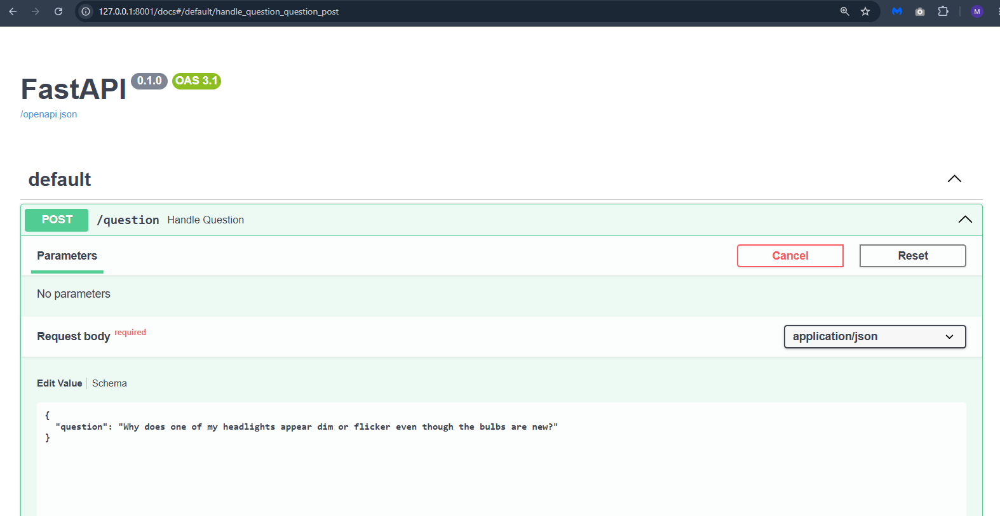
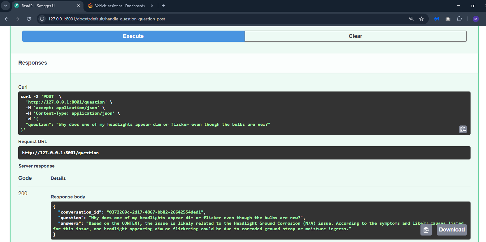
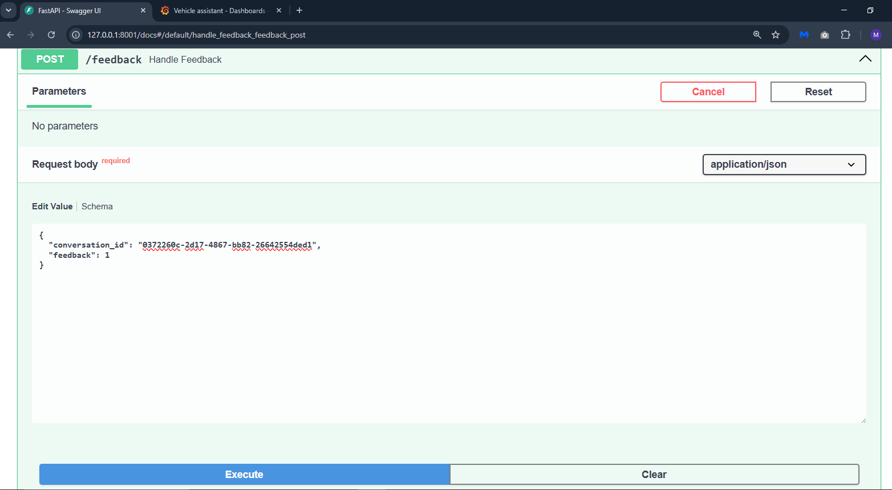
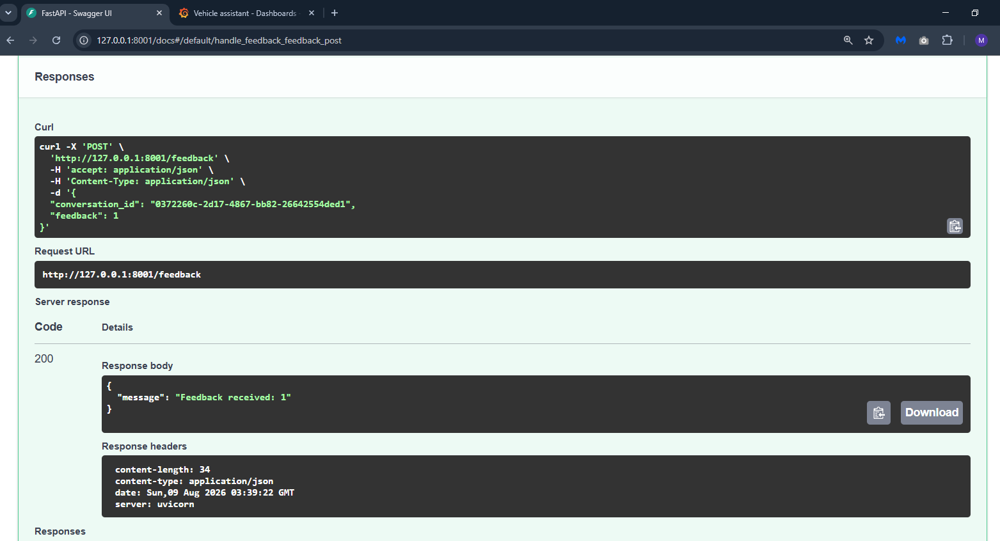
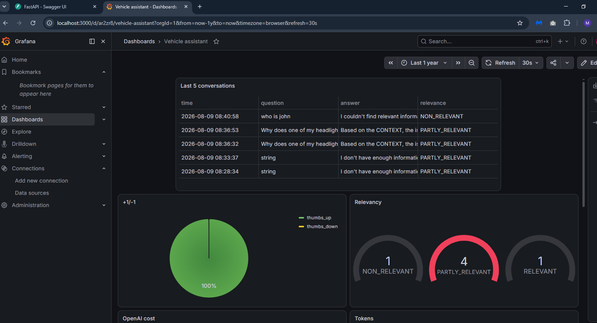

# 🚗 Vehicle Diagnostic Assistant (Agentic RAG)

An advanced, enterprise-grade **Agentic Retrieval-Augmented Generation (RAG)** application for vehicle diagnostics. Built with **LangGraph**, **FastAPI**, **ChromaDB**, **SQLite Search**, **PostgreSQL**, **Grafana**, and **OpenTelemetry**, this system assists users in diagnosing vehicle issues using a hybrid search pipeline, document grading, query rewriting, automated LLM-as-a-judge evaluation, distributed tracing, and real-time operational monitoring.

---

## 🛠️ Technology Stack & Component Breakdown

Every technology in this repository is strictly aligned with the source code:

| Technology / Library | Role & Purpose in Project |
| :--- | :--- |
| **FastAPI & Uvicorn** | High-performance Python web framework (`project/app.py`) running Uvicorn ASGI server hosting REST API endpoints (`/question`, `/feedback`). |
| **LangGraph (v2 Agentic RAG)** | Stateful orchestration graph (`StateGraph` in `project/versions/v2/rag.py`) managing the agentic lifecycle: **Hybrid Search ➔ Document Grading ➔ Query Rewriting ➔ Answer Generation / Fallback**. |
| **LangChain & ChatOpenAI** | Abstraction layer connecting to LLM providers via Groq API base URL (`https://api.groq.com/openai/v1`), executing structured prompt templates and chains. |
| **LangChain-Chroma** | Integration between LangChain and ChromaDB for vector storage and retrieval operations. |
| **LangChain-Google-GenAI** | Google Generative AI integration support for potential alternative LLM providers. |
| **ChromaDB** | Vector database (`project/chroma_db`) storing dense vector embeddings of vehicle diagnostic issues for semantic similarity retrieval. |
| **ONNX Runtime & Tokenizers** | Local embedding execution (`embedder.py`) using an ONNX-quantized `Xenova/all-MiniLM-L6-v2` model downloaded via `download.py` for fast CPU-based embeddings without API costs. |
| **sqlitesearch (BM25 SQLite)** | SQLite-backed full-text keyword search engine (`project/issues.db`) with field boosting (`issue_name`, `obd_code`, `symptoms`, `diagnostic_steps`, etc.). |
| **minsearch** | Lightweight memory-based search engine used in early RAG prototyping (`project/ingest.py`). |
| **Reciprocal Rank Fusion (RRF)** | Hybrid search ranker combining top search results from dense vector search (ChromaDB) and sparse text search (SQLite BM25). |
| **PostgreSQL & psycopg2** | Relational database (`project/db.py`) storing detailed conversation logs, response time metrics, token usage, cost tracking, relevance evaluation results, and user feedback (+1 / -1). |
| **Grafana** | Real-time operational dashboard visualizing token usage, response latency, LLM cost, relevance scores, feedback trends, and distributed tracing metrics (`project/dashboard.json`). |
| **OpenTelemetry** | Distributed tracing framework (`project/tracerdb.py`) capturing span data for operation monitoring, including input/output tokens, cost, and duration metrics via PostgreSQL span export. |
| **Pydantic** | Data validation and structured output framework used in notebook for generating synthetic vehicle issues with type-safe field definitions. |
| **Pandas** | Data manipulation library used in notebook for processing vehicle issues dataset and generating ground truth questions. |
| **NumPy** | Numerical computing library supporting array operations and mathematical functions used in data processing. |
| **scikit-learn** | Machine learning library providing tools for data analysis and potential ML-based improvements. |
| **python-dotenv** | Environment variable management for loading configuration from `.env` files. |
| **Requests** | HTTP library used for API calls in Grafana provisioning and external service integration. |
| **tqdm** | Progress bar library used in notebook for tracking data generation progress. |
| **Hugging Face Hub** | Model repository integration for downloading pre-trained models and tokenizers. |
| **Groq API** | LLM inference API running model `openai/gpt-oss-120b` with support for structured output parsing. |
| **Docker & Docker Compose** | Multi-container environment orchestrating `app` (FastAPI), `postgres` (PostgreSQL 16), and `grafana` (Grafana Latest). |
| **`uv` (by Astral)** | Blazing-fast Python package and project environment manager used in `Dockerfile` (`python:3.14-slim`) and dependency resolution (`pyproject.toml`, `uv.lock`). |
| **Jupyter Notebook** | Environment for synthetic data generation, search index experimentation, and offline RAG benchmarking (`project/data/data-creation-and-evaluation.ipynb`). |

---

## 📁 Detailed Codebase & File Architecture

Here is the exact responsibility of every file in the repository:

### Root Files
- **`Dockerfile`**: Docker build definition using `python:3.14-slim` and `uv` package installer to build and run the FastAPI app (`uvicorn project.app:app --host 0.0.0.0 --port 8000 --reload`).
- **`docker-compose.yaml`**: Orchestrates 3 services (`postgres` on 5432, `app` on 8001:8000, and `grafana` on 3000).
- **`pyproject.toml` & `uv.lock`**: Python project configuration and exact dependency lockfile.
- **`download.py`**: Downloads ONNX weights (`model.onnx`) and `tokenizer.json` for `Xenova/all-MiniLM-L6-v2` from Hugging Face Hub into `models/Xenova/all-MiniLM-L6-v2/`.
- **`embedder.py`**: Implements custom `Embedder` class using `onnxruntime` and `tokenizers` to compute dimensional dense text embeddings locally on CPU.

### `project/` Directory
- **`project/app.py`**: FastAPI application.
  - `POST /question`: Receives user question, generates UUID `conversation_id`, executes `rag.query()`, saves result to PostgreSQL, and returns response.
  - `POST /feedback`: Receives `{ "conversation_id": "...", "feedback": 1 | -1 }` and saves to PostgreSQL.
- **`project/db.py`**: PostgreSQL database connector (`get_db_connection`) and schema manager (`init_db`, `save_conversation`, `save_feedback`).
- **`project/init.py`**: Automated provisioning script for Grafana. Creates `ProgrammaticSA` Service Account, generates API token, configures PostgreSQL datasource with consistent UID (`vehicle-assistant-postgres`), dynamically updates datasource UIDs in `project/dashboard.json`, and imports the dashboard.
- **`project/dashboard.json`**: Pre-configured Grafana dashboard JSON containing 15 panels for comprehensive monitoring of conversations, spans, and system metrics.
- **`project/ingest.py`**: Loader script for building an in-memory `minsearch` index from `data/data.csv`.
- **`project/ingest_sqlite.py`**: Loader script connecting to the SQLite full-text search index at `project/issues.db`.
- **`project/ingest_fresh_or_load_data.py`**: Data loading script that either loads existing SQLite BM25 index and ChromaDB vector store or builds fresh ones from `data/data.csv`.
- **`project/issues.db`**: SQLite database for BM25 text search.
- **`project/tracerdb.py`**: OpenTelemetry span exporter that writes tracing data to PostgreSQL, capturing operation names, start/end times, input/output tokens, and costs.
- **`project/versions/v2/rag.py`**: Production **LangGraph Agentic RAG** graph:
  - **`RAGState`**: TypedDict schema tracking query, rewritten query, documents, generation, relevance score, retries, and max retries.
  - **`hybrid_search`**: Merges SQLite BM25 text search (with field boosts) and ChromaDB vector search using Reciprocal Rank Fusion (RRF).
  - **`grade_documents`**: LLM node evaluating retrieved document relevance scores (0.0 to 1.0) and keeping relevant context.
  - **`rewrite_query`**: LLM query rewriter node invoked when retrieval relevance falls below threshold.
  - **`generate_answer`**: Constructs answer strictly from retrieved context and executes `evaluate_relevance` (LLM-as-a-Judge rating `RELEVANT`, `PARTLY_RELEVANT`, `NON_RELEVANT`) and calculates token costs.
  - **`generate_fallback`**: Returns a structured fallback response when no context matches after retries.
- **`project/versions/v1/rag.py`**: Legacy basic RAG implementation using OpenAI client directly.

### `project/data/` Directory
- **`data/data.csv`**: Synthetic dataset containing 50 diagnostic issue records (OBD codes, symptoms, likely causes, diagnostic steps, diy/mechanic recommendation) generated via Groq API using Pydantic models for structured output.
- **`data/ground-truth-retrieval.csv`**: Benchmark ground-truth QA dataset mapping questions to `issue_id`s, generated automatically from the vehicle issues using LLM prompts for evaluation purposes.
- **`data/rag-eval-groq/openai/gpt-oss-120b.csv`**: Evaluation results for the GPT-OSS-120b model.
- **`data/data-creation-and-evaluation.ipynb`**: Complete Jupyter notebook for synthetic data generation and evaluation setup:
  - **Synthetic Data Generation**: Uses Groq API with Pydantic models (`VehicleIssue`, `VehicleIssueDataset`) to generate 50 diverse, realistic vehicle issues across different systems (engine, transmission, brakes, electrical, suspension, cooling) with real OBD-II codes
  - **LLM Integration**: Basic LLM wrapper function for Groq API interactions
  - **Ground Truth Question Generation**: Automatically generates 2 evaluation questions per vehicle issue using LLM prompts, creating a comprehensive QA dataset for retrieval benchmarking
  - **Data Processing**: Handles JSON parsing, markdown code fence stripping, and duplicate removal during data generation
  - **Note**: Cell 3 (RAG query testing) requires Docker environment due to PostgreSQL hostname resolution - designed for container execution

---

## 🏗️ System Architecture & Workflow

```
[ User Request ]
       │
       ▼
[ FastAPI App (/question) ]
       │
       ▼
[ LangGraph Agentic Pipeline (v2/rag.py) ]
  ├── 1. Hybrid Search (ChromaDB Vector + SQLite BM25 -> RRF Ranker)
  ├── 2. Grade Documents (LLM evaluates retrieved context relevance)
  ├── 3. Query Rewrite (If relevance score < threshold, rewrites query & retries)
  ├── 4. Generate Answer / Fallback (Constructs answer strictly from context)
  ├── 5. Auto-Evaluate Relevance (LLM-as-a-Judge rates output relevance)
  └── 6. OpenTelemetry Tracing (Captures span data for monitoring)
       │
       ├─────────────────────────────────────────┐
       ▼                                         ▼
[ PostgreSQL Database ]                 [ JSON API Response ]
  (Saves tokens, cost, latency,            (Returns conversation_id & answer)
   eval score, spans & user feedback)               │
       │                                         ▼
       ▼                                 [ User Feedback ]
[ Grafana Dashboard ]                       (POST /feedback)
  (Real-time analytics, graphs & tracing)         │
                                                 └──► Saved to Postgres
```

---

## 📋 Prerequisites

Ensure you have the following installed on your host machine:

- **Docker** & **Docker Compose** (v2.0+)
- **Git**
- **Groq API Key** (Get a free key from [Groq Console](https://console.groq.com/))
- **Python 3.12+** (for local notebook execution and development)
- **Jupyter Notebook** (for running `project/data/data-creation-and-evaluation.ipynb`)

---

## 🚀 Step-by-Step Setup Guide

### Step 1: Clone the Repository
```bash
git clone https://github.com/combatant936-sketch/vehicle_assistant.git
cd vehicle-assistant
```

### Step 2: Configure Environment Variables
Create a `.env` file in the root directory by copying `.env.example`:

```bash
cp .env.example .env
```

Open `.env` and set your configuration parameters:

```env
GROQ_API_KEY=gsk_your_actual_groq_api_key_here
AI_MODEL=openai/gpt-oss-120b
MODEL_BASE_URL=https://api.groq.com/openai/v1
POSTGRES_HOST=postgres
POSTGRES_DB=vehicle_assistant
POSTGRES_USER=user
POSTGRES_PASSWORD=password
POSTGRES_PORT=5432
GRAFANA_ADMIN_USER=admin
GRAFANA_ADMIN_PASSWORD=admin
GRAFANA_URL=http://grafana:3000
GRAFANA_SECRET_KEY=some-random-string-you-pick
SQLITESEARCHDB=project/issues.db
CHROMA_COLLECTION=obd_diagnostics
CHROMA_DB_DIR=project/chroma_db
DATA_PATH=project/data/data.csv
```

### Step 3: Build & Start Services
Launch all containers using Docker Compose:

```bash
docker compose up -d --build
```

This starts 3 containers:
- **`postgres`**: Relational DB on port `5432`
- **`app`**: FastAPI RAG Server on port `8001` (mapped to internal `8000`)
- **`grafana`**: Monitoring Dashboard on port `3000`

### Step 4: Initialize Database & Grafana Dashboard
Run the setup commands inside the app container to set up tables, datasources, and dashboards:

**1. Initialize PostgreSQL Tables:**
```bash
docker compose exec app python -c "from project import db; db.init_db()"
```

**2. Initialize Grafana Datasource & Dashboard:**
```bash
docker compose exec app python project/init.py
```

---

## 📖 API Usage & Endpoints

### 1. Ask a Diagnostic Question (`POST /question`)

**Request**:
```bash
curl -X POST http://localhost:8001/question \
  -H "Content-Type: application/json" \
  -d '{
    "question": "What causes engine misfires?"
  }'
```

**Response**:
```json
{
  "conversation_id": "07e72c1f-3fc1-4163-b182-67a23de7d0f8",
  "question": "What causes engine misfires?",
  "answera": "Based on the provided CONTEXT, engine misfires can be caused by worn spark plugs, faulty ignition coils, low fuel pressure, or vacuum leaks..."
}
```



### 2. Submit User Feedback (`POST /feedback`)

**Request**:
```bash
curl -X POST http://localhost:8001/feedback \
  -H "Content-Type: application/json" \
  -d '{
    "conversation_id": "07e72c1f-3fc1-4163-b182-67a23de7d0f8",
    "feedback": 1
  }'
```
*(Use `1` for positive / thumbs up, `-1` for negative / thumbs down)*

**Response**:
```json
{
  "message": "Feedback received: 1"
}
```

---




## 📊 Data Generation & Evaluation

### Synthetic Data Generation Process

The project includes automated synthetic data generation using the Jupyter notebook `project/data/data-creation-and-evaluation.ipynb`:

1. **Vehicle Issues Generation**: 
   - Uses Groq API with Pydantic models (`VehicleIssue`, `VehicleIssueDataset`)
   - Generates 50 diverse, realistic vehicle diagnostic issues
   - Covers multiple systems: engine, transmission, brakes, electrical, suspension, cooling
   - Includes real OBD-II codes (P0171, P0300, P0420, P0455, etc.)
   - Structured fields: issue_id, issue_name, obd_code, system, component, severity, symptoms, likely_causes, diagnostic_steps, diy_or_mechanic
   - Output: `project/data/data.csv`

2. **Ground Truth QA Generation**:
   - Automatically generates 2 evaluation questions per vehicle issue
   - Uses LLM prompts based on diagnostic information
   - Creates comprehensive QA dataset for retrieval benchmarking
   - Output: `project/data/ground-truth-retrieval.csv`

### Notebook Usage

**Important**: The notebook `data/data-creation-and-evaluation.ipynb` has different execution environments:

- **Cells 0-1, 2, 4**: Can run locally with proper `.env` configuration and Groq API key
- **Cell 3**: Requires Docker environment due to PostgreSQL hostname resolution ("postgres")
- **For full notebook execution**: Run inside Docker container using `docker compose exec app jupyter notebook`

**To run the notebook locally** (for data generation only):
```bash
# Install dependencies locally
pip install -r pyproject.toml

# Set up environment variables
cp .env.example .env
# Edit .env with your Groq API key

# Run Jupyter
jupyter notebook project/data/data-creation-and-evaluation.ipynb
```

**To run the notebook in Docker**:
```bash
docker compose exec app jupyter notebook --allow-root --ip=0.0.0.0 --port=8888
# Access at http://localhost:8888
```

---

## 📊 Analytics & Grafana Dashboard

Open your browser and navigate to:
```
http://localhost:3000
```
- **Login**: `admin` / `admin` (or the credentials set in `.env`)
- Navigate to **Dashboards ➔ Vehicle assistant** (dashboard UID will be provided after running init script).

### Dashboard Metrics Tracked:

#### Conversation Metrics:
- 💬 **Last Conversations Table**: Live feed of questions, answers, and relevance ratings.
- 🎯 **Relevancy Gauge**: Visual breakdown of `RELEVANT`, `PARTLY_RELEVANT`, and `NON_RELEVANT` ratings.
- ⚡ **Response Time**: Full execution latency tracking for the agentic RAG flow.
- 🪙 **Token Consumption**: Real-time breakdown of prompt vs completion tokens.
- 💵 **GROQ Cost**: LLM API cost calculated per conversation.
- 👍 **User Feedback**: Aggregated thumbs up (+1) vs thumbs down (-1) metrics.
- 🤖 **Model Used**: Distribution of AI models used for responses.

#### Distributed Tracing Metrics:
- 🔍 **Recent Span Operations**: Table showing recent tracing operations with tokens, cost, and duration.
- 📊 **Input Tokens Over Time**: Time series of input token usage from span data.
- 📊 **Output Tokens Over Time**: Time series of output token usage from span data.
- 💰 **Cost Over Time**: Time series of operational costs from span tracing.
- ⏱️ **Operation Duration**: Time series showing operation execution times.
- 🥧 **Operation Types**: Pie chart showing distribution of operation types (e.g., `rag_query`, `generate_answer`).
- 📈 **Operation Statistics**: Table with aggregated statistics by operation type.

---




## ⚙️ Useful Management Commands

```powershell
# View live application logs
docker compose logs -f app

# Rebuild and restart application after code changes
docker compose up -d --build --force-recreate app

# Query PostgreSQL conversations table directly
docker compose exec postgres psql -U user -d vehicle_assistant -c "SELECT question, relevance, total_tokens, groq_cost FROM conversations;"

# Query PostgreSQL spans table for tracing data
docker compose exec postgres psql -U user -d vehicle_assistant -c "SELECT name, input_tokens, output_tokens, cost FROM spans LIMIT 5;"

# Stop all services
docker compose down

# If grafana or other docker containers not running just rerun that image or container
```

## 🔧 Key Features

- **Hybrid Search**: Combines dense vector search (ChromaDB) with sparse text search (SQLite BM25) using Reciprocal Rank Fusion for improved retrieval accuracy.
- **Agentic Workflow**: LangGraph-based state machine with document grading, query rewriting, and fallback mechanisms.
- **Auto-Evaluation**: LLM-as-a-judge system that automatically evaluates answer relevance with ratings (RELEVANT, PARTLY_RELEVANT, NON_RELEVANT).
- **Distributed Tracing**: OpenTelemetry integration for monitoring operation performance and resource usage with span export to PostgreSQL.
- **Real-time Analytics**: Comprehensive Grafana dashboard with 15 panels covering conversations, spans, and system metrics.
- **Consistent Configuration**: Automated Grafana provisioning with consistent datasource UIDs (`vehicle-assistant-postgres`) for easy redeployment.
- **Local Embeddings**: ONNX-based local embeddings using `Xenova/all-MiniLM-L6-v2` for fast, cost-free vector generation.
- **Synthetic Data Generation**: Automated LLM-powered generation of 50 diverse vehicle diagnostic issues using Groq API with Pydantic structured output.
- **Ground Truth QA Dataset**: Automatic generation of evaluation questions (2 per issue) for retrieval benchmarking and RAG evaluation.
